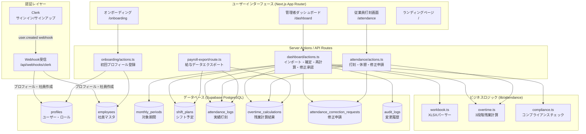

# システムアーキテクチャ

## 概要

MINORU Attendance は、1か月単位の変形労働時間制（労基法第32条の2）に準拠した勤怠管理システム。
Next.js 16 (App Router) + Clerk 認証 + Supabase PostgreSQL で構成される。

---

## 全体構成図



---

## レイヤー別詳細

### 1. フロントエンド (App Router)

| ページ | パス | ロール | 主な機能 |
|--------|------|--------|---------|
| ランディング | `/` | 全員 | マーケティング・料金案内 |
| サインイン | `/sign-in` | 未認証 | Clerk 認証UI |
| オンボーディング | `/onboarding` | 新規ユーザー | 初回社員情報登録 |
| 打刻画面 | `/attendance` | 従業員 | 出退勤・休憩打刻・修正申請 |
| 管理者ダッシュボード | `/dashboard` | admin/manager | シフト管理・インポート・承認 |

### 2. 認証フロー

```
ユーザー登録（Clerk）
    ↓
Webhook POST /api/webhooks/clerk（user.created）
    ↓ svixで署名検証
profiles テーブルへ挿入（role = employee）
employees テーブルへ挿入（初期レコード）
    ↓
/onboarding にリダイレクト → 社員情報補完
```

### 3. ビジネスロジック

#### 3.1 XLSXパーサー (`workbook.ts`)

出勤簿.xlsx のセルマッピング:

| セル | 内容 |
|------|------|
| A1 | 年 |
| D1 | 月 |
| D3 | 社員番号 |
| J3 | 氏名 |
| AA3 | 部署 |
| E列（13行〜） | 勤務区分（出勤/休日/休業(時間)等） |
| I列（13行〜） | 実績出勤時刻 |
| L列（13行〜） | 実績退勤時刻 |
| O列（13行〜） | 予定出勤時刻 |
| R列（13行〜） | 予定退勤時刻 |
| U列（13行〜） | 予定休憩時間 |
| AL列（13行〜） | 追加休憩時間 |
| AN列（13行〜） | キャッシュ済み実績時間 |

- 処理: fflate でXLSXをZIP展開 → `xl/workbook.xml` でシート名解決 → `xl/sharedStrings.xml` で共有文字列解決 → シートXMLをパース
- 末日締シート: 当月1日〜末日
- 20日締シート: 前月21日〜当月20日
- 文字化け対策: `normalizeDayType` で全角括弧・空白・Shift-JIS由来の文字列を正規化

#### 3.2 残業計算エンジン (`overtime.ts`)

厚生労働省リーフレット（労基法32条の2）に基づく3段階判定:

```
法定総枠（分）= round(週法定時間(分) × 暦日数 ÷ 7)

① 日次OT（日ごとに計算）
   日の上限 = max(所定労働時間, 8h×60)
   dailyOtMinutes = max(0, 実労働時間 - 日の上限)

② 週次OT（週ごとに計算、7日未満の端数週は除外→③へ）
   週の上限 = max(週所定時間合計, 週法定時間)
   weeklyOtMinutes = max(0, 週実労働合計 - 週の上限 - 週内①合計)
   ※ 週の最終日のレコードに計上

③ 期間OT（期間全体で1回計算）
   periodOtMinutes = max(0, 期間実労働合計 - 法定総枠 - ①合計 - ②合計)
   ※ 期間最終日のレコードに計上
```

割増賃金計算例（時給1,000円、31日月・週40h・所定172h）:

| 種別 | 計算式 | 金額 |
|------|--------|------|
| 基本賃金 | 1,000 × 172 | 172,000円 |
| 法定内残業 | 1,000 × 法定内時間 | 割増なし |
| 法定外残業（①③④） | 1,000 × 1.25 × OT時間 | +25%割増 |
| 期間OT（⑤） | 1,000 × 0.25 × OT時間 | +25%割増 |

#### 3.3 コンプライアンスチェック (`compliance.ts`)

| 対象者 | チェック | レベル | 根拠 |
|--------|---------|--------|------|
| 年少者（18歳未満） | 1日8h超 | エラー | 労基法60条 |
| 年少者（18歳未満） | 週40h超 | エラー | 労基法60条 |
| 妊産婦 | 1日8h超 | エラー | 労基法66条 |
| 妊産婦 | 週40h超 | エラー | 労基法66条 |
| 育児・介護等配慮対象 | 配慮事項の確認 | 警告 | 労基法32条の2(注1) |

エラーレベルはシフトの保存をブロックする。警告レベルは保存後に管理者へ表示する。

### 4. データベース設計

#### テーブル一覧

| テーブル | 主キー | 用途 |
|---------|--------|------|
| `profiles` | `id` (Clerk userId) | ユーザーとロールの紐付け |
| `employees` | `id` (serial) | 社員マスタ（`employee_code` 一意） |
| `monthly_periods` | `id` (serial) | 対象期間・法定総枠 |
| `shift_plans` | `id` (serial) | 予定シフト（`employee_id,work_date` 一意） |
| `attendance_logs` | `id` (serial) | 実績打刻（`employee_id,work_date` 一意） |
| `overtime_calculations` | `id` (serial) | 残業計算結果（`employee_id,work_date,calc_version` 一意） |
| `attendance_correction_requests` | `id` (serial) | 修正申請 |
| `audit_logs` | `id` (serial) | 変更履歴 |

#### ステータス遷移

```
monthly_periods.status:  draft → confirmed → closed
shift_plans.status:      draft → confirmed
correction_requests.status: pending → approved / rejected
```

#### RLS方針

- 全テーブルでRLS有効
- 従業員: 自身の `user_id` に紐づくデータのみ参照・挿入可
- 管理者操作: `SUPABASE_SERVICE_ROLE_KEY` を使うサーバーサイドの管理者クライアントで実行

### 5. データフロー

#### シフト登録フロー（Excelインポート）

```
xlsx アップロード
    ↓ parseAttendanceWorkbook()
社員情報・期間・日別データを抽出
    ↓ checkCompliance()
コンプライアンスエラー？ → エラーを返して終了
    ↓
employees upsert（employee_code）
monthly_periods upsert（start_date + end_date）
shift_plans upsert（employee_id + work_date）
attendance_logs upsert（employee_id + work_date）
    ↓ calculateOvertime()
overtime_calculations upsert（employee_id + work_date + calc_version）
audit_logs insert
    ↓
revalidatePath("/dashboard")
```

#### 打刻フロー（従業員）

```
出勤打刻 → attendance_logs insert（actual_start）
    ↓
休憩開始 → attendance_logs update（current_break_start）
休憩終了 → attendance_logs update（actual_break_minutes 累積, current_break_start = null）
    ↓
退勤打刻 → attendance_logs update（actual_end, actual_work_minutes）
    ↓ recalculateEmployeePeriod()
overtime_calculations upsert
revalidatePath("/attendance", "/dashboard")
```

#### 修正申請フロー

```
従業員: submitCorrectionRequest()
    → attendance_correction_requests insert（status: pending）

管理者: approveCorrection()
    → attendance_logs upsert（修正値）
    → attendance_correction_requests update（status: approved）
    → recalculateLatestPeriod()
    → revalidatePath("/dashboard")

管理者: rejectCorrection()
    → attendance_correction_requests update（status: rejected）
```

---

## マイグレーション履歴

| ファイル | 内容 |
|---------|------|
| `20260414053336_init_attendance_schema.sql` | コアスキーマ初期化 |
| `20260416000000_add_break_start.sql` | `current_break_start` カラム追加 |
| `20260416000001_clerk_auth_update.sql` | Clerk連携対応 |
| `20260420000000_add_compliance_flags.sql` | コンプライアンスフラグ追加 |
| `20260420000001_add_correction_requests.sql` | 修正申請テーブル追加 |

---

## 技術選定の理由

| 技術 | 選定理由 |
|------|---------|
| Next.js 16 App Router | Server Actionsでサーバー側処理をコロケーション、RSCでDBアクセスをシンプル化 |
| Clerk | ソーシャルログイン・ユーザー管理をノーコードで提供。Webhook でDB同期 |
| Supabase | PostgreSQL + RLS で行レベルのセキュリティを宣言的に管理 |
| fflate | XLSX（ZIP形式）をブラウザ・サーバー両対応で軽量展開 |
| Tailwind CSS v4 | ゼロランタイムCSS、JITコンパイルで高速 |
